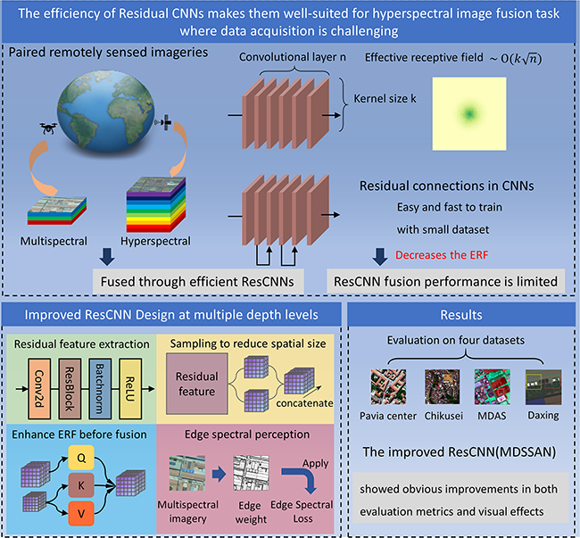

# MDSSAN Project Overview

> A Multiple Depth‐Level Spatial–Spectral Aggregation Network for Enhancing Multispectral and Hyperspectral Image Fusion.

This repository provides a deep learning framework and a collection of models for hyperspectral image (HSI)  fusion with visible/RGB images.



---


## Directory Structure

```
MDSSAN/
├── configs/                # Training configs (example:    config_rgb.json)
├── dataloaders/            # Data loading and preprocessing
├── datasets/               # Datasets (Chikusei / Pavia) and list files
├── experiments/            # Outputs (logs, weights, etc., created after runs)
├── models/                 # Model implementations (MDSSAN, SSRNET, MSDCNN, TFNET, etc.)
├── utils/                  # Utilities (augmentation, metrics, losses, visualization, etc.)
├── train_rgb.py            # Training entry script (example)
└── README.md               # Project description (this file)
```

---

## Requirements

- Python 3.8/3.9
- PyTorch (recommended 1.9+; a CUDA-enabled GPU greatly accelerates training)
- Common packages: `numpy`, `scipy`, `scikit-image`, `opencv-python`, `tqdm`, `matplotlib`, `Pillow`

> Note: choose exact versions based on your local setup and GPU driver. CPU-only training works but will be slow.

### Installation

- Option A (conda):

```bash
conda create -n mdssan python=3.9 -y
conda activate mdssan
pip install torch torchvision --index-url https://download.pytorch.org/whl/cu118  # pick the URL matching your CUDA
pip install numpy scipy scikit-image opencv-python tqdm matplotlib pillow
```

- Option B (pip + venv):

```bash
python -m venv .venv
./.venv/Scripts/Activate.ps1  # Windows PowerShell
pip install torch torchvision
pip install numpy scipy scikit-image opencv-python tqdm matplotlib pillow
```

---

## Data Preparation

This repo includes example structures and list files for `datasets/chikusei` and `datasets/pavia` (e.g., `train.txt`, `val.txt`, `train_dhp.txt`).

- Place raw data under the corresponding subfolders, e.g.:
  - `datasets/chikusei/chikusei_01/`, `datasets/chikusei/chikusei_02/`, ...
  - `datasets/pavia/pavia_01/`, `datasets/pavia/pavia_02/`, ...
- List files (`train.txt`, `val.txt`, etc.) describe training/validation samples. Use the provided templates and naming conventions as a reference.
- For custom datasets, follow a similar convention (each line describes one sample or sample pair via relative paths) and update paths in the config accordingly.

---

## Quick Start

### 1) Configs

`configs/config_rgb.json` is an example config. Typical fields include dataset roots, train/val lists, model name, optimizer and learning rate, batch size, training epochs, output directory, etc. Refer to the file for exact keys.

### 2) Training

Run from the project root:

```bash
python train_rgb.py --config configs/config_rgb.json
```

- Logs, model weights, and visualizations are usually saved under `experiments/` (or the output path specified in the config).
- If you see path errors, double-check dataset roots and the existence of the list files.

### 3) Evaluation & Visualization

- The training script computes common metrics on the validation set (PSNR/SSIM, etc.).
- Use `utils/visualize.py` for qualitative comparisons; or build custom evaluation scripts on top of `utils/metrics.py`.

---

## Troubleshooting

- Paths and filenames: ensure all paths in the config and list files exist and are readable.
- GPU/VRAM limits: reduce `batch_size` or crop size; disable expensive losses (e.g., perceptual loss) if necessary.
- Dependency conflicts: prefer an isolated virtual environment; check versions with `pip list` or `conda list` when issues arise.

---

## Reproducibility & Experiment Logs

- Keep each experiment’s config, logs, and weights under subfolders in `experiments/` for easier reproduction and comparison.
- To compare different models (e.g., `MDSSAN.py` vs `SSRNET.py`), create separate configs and output directories for each.

---

## Citation

If this project is helpful in your work, please cite the paper and this repository, for example:

- Related paper: `The Photogrammetric Record-2025-Zhou-MDSSAN.pdf` (at the repo root)

Example BibTeX:

```bibtex
@article{Zhou2025AMD,
  title={A Multiple Depth‐Level Spatial–Spectral Aggregation Network for Enhancing Multispectral and Hyperspectral Image Fusion},
  author={Bo Zhou and Ziyuan Feng and Miao Ren and Xiaobo Zhi and Xianfeng Zhang},
  journal={The Photogrammetric Record},
  year={2025},
  volume={40},
  url={https://api.semanticscholar.org/CorpusID:280927257}
}
```

---

## Contributing

- Feel free to open issues for bug reports or feature requests.
- Pull requests are welcome (new models, improved data pipelines, documentation, etc.).

---

## License

- The license follows the repository’s actual setting. If none is declared, all rights are reserved by default. For commercial use or redistribution, please contact the authors and comply with relevant terms.

---

## Acknowledgements

- Thanks to the open-source community and contributors of the datasets/tools used in this project.
- Some implementations are inspired by common practices in image reconstruction and deep learning libraries.

---

For questions or suggestions, please open an issue.
